# 🏥 Kudrat Memorial Hospital Management System (KMHMS)

An advanced **Hospital Management System** developed using **Odoo** for efficient management of hospital operations.  
The system includes five key modules: **Patients**, **Doctors**, **Departments**, **Appointments**, and **Medical Tests** — each with multiple dynamic views *(Tree, Form, Search, Kanban, Gantt, Pivot, Graph, Calendar)* to streamline hospital workflows.

---

## ✨ Key Features

- 👨‍⚕️ Manage doctors, departments, patients, and appointments efficiently  
- 🗓️ Multiple visualization views (Tree, Kanban, Calendar, Pivot, Graph, Gantt)  
- 🧭 Integrated map view for doctor locations  
- 🧪 Manage medical tests and patient reports  
- 🔍 Smart search and filtering system  
- 🏗️ Built entirely with **Odoo Framework**

---

## 🧑‍🤝‍🧑 0. Patients Module

All patient information is displayed in **Tree View** with options to **create, view, and manage** patient records.

**Features:**
- View patient list  
- Create new patient records  
- One2many relationship: *One patient can have many appointments*

📸 **Screenshots**

| Overview | Patient Details | One2many View |
|-----------|----------------|----------------|
| 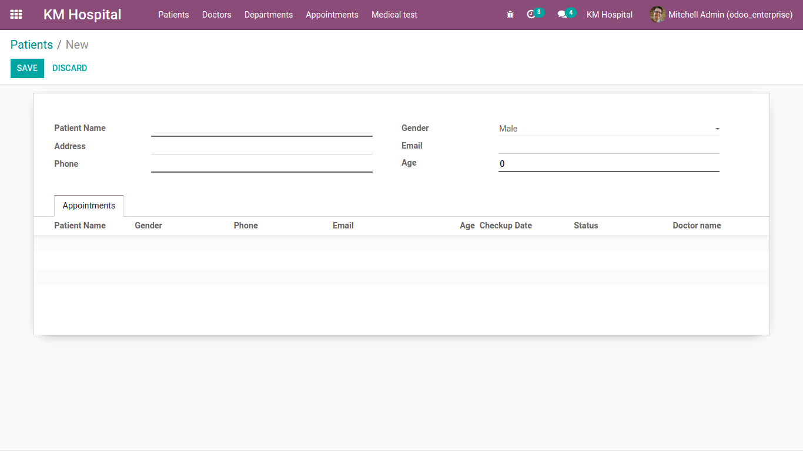 | 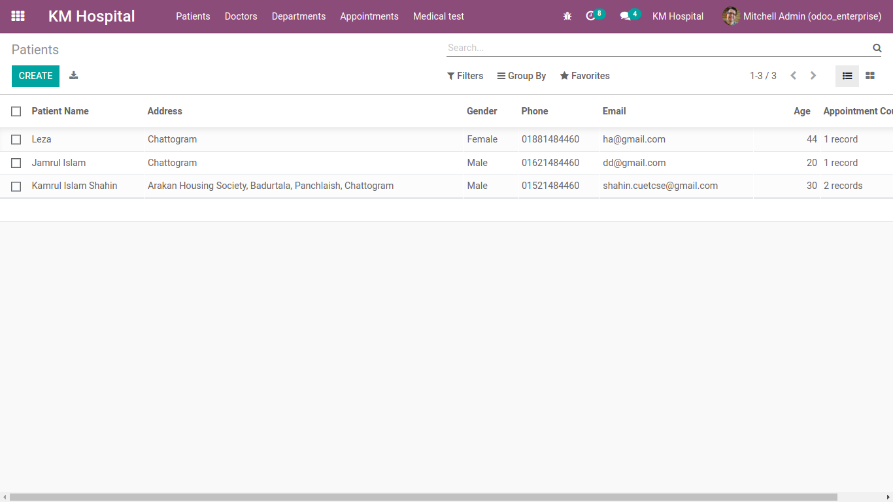 |  |

---

## 🩺 1. Doctors Module

Displays all doctors’ profiles with the ability to **add, edit, and view** detailed information.

**Features:**
- Doctor list and profile management  
- Integrated **map view** to visualize doctor locations  
- Department association and scheduling  

📸 **Screenshots**

| Doctor List | Doctor Profile | Map View |
|--------------|----------------|----------|
| 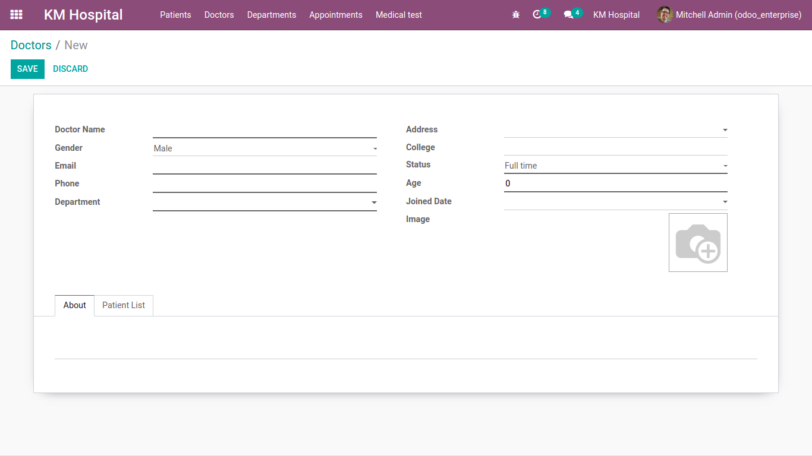 | 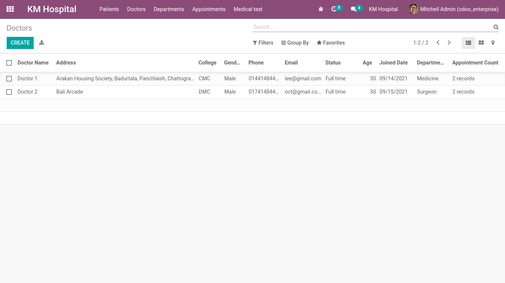 | 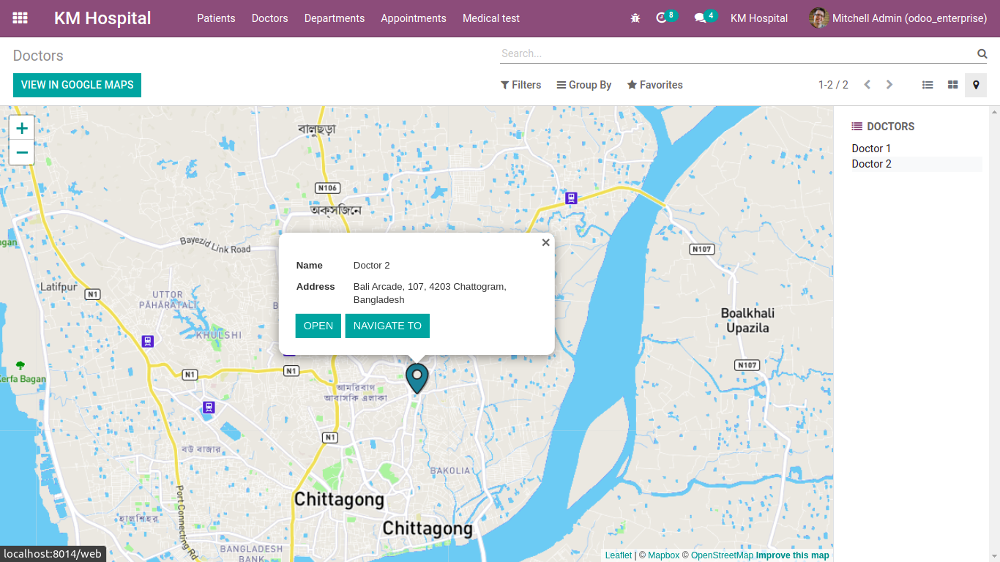 |

Additional View:  
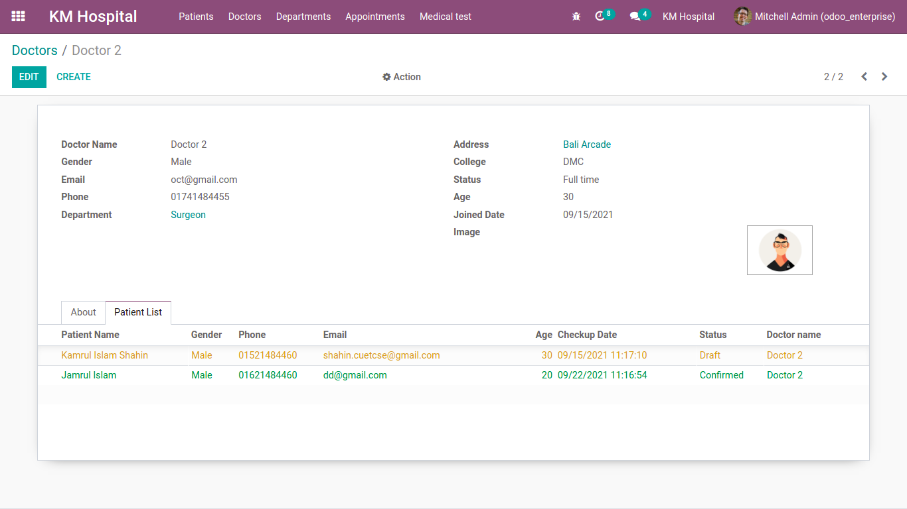

---

## 🏢 2. Department Module

Displays all hospital departments with options to **add new departments** and assign doctors.

📸 **Screenshot**

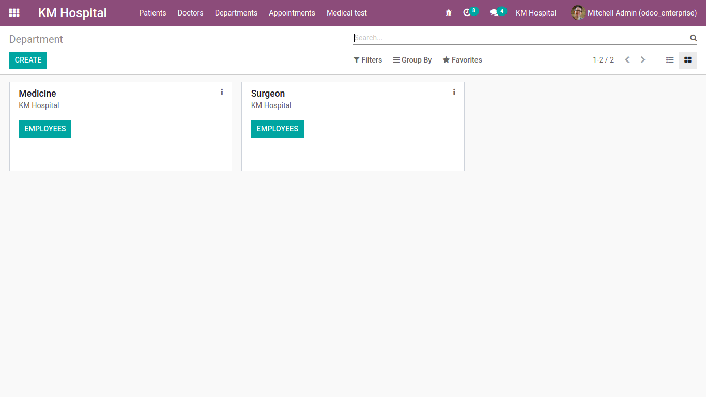

---

## 📅 3. Appointments Module

Comprehensive appointment management with multiple view options for visualization and tracking.

**Features:**
- Appointment scheduling and management  
- View appointments by date, department, or doctor  
- Multiple dynamic views: *List, Kanban, Calendar, Pivot, Graph, Gantt*

📸 **Screenshots**

| View Type | Preview |
|------------|----------|
| Form / Details | 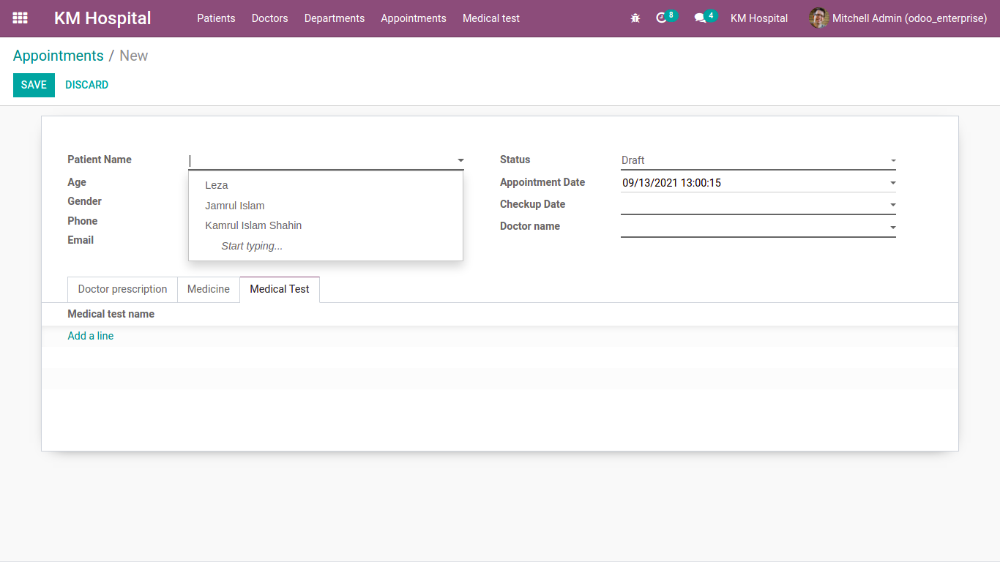 |
| Tree View | 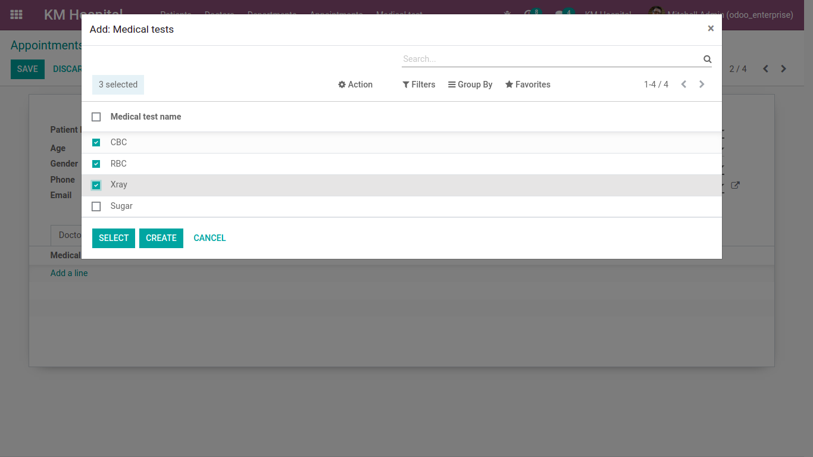 |
| Form (Detailed) |  |
| List View |  |
| Kanban View | 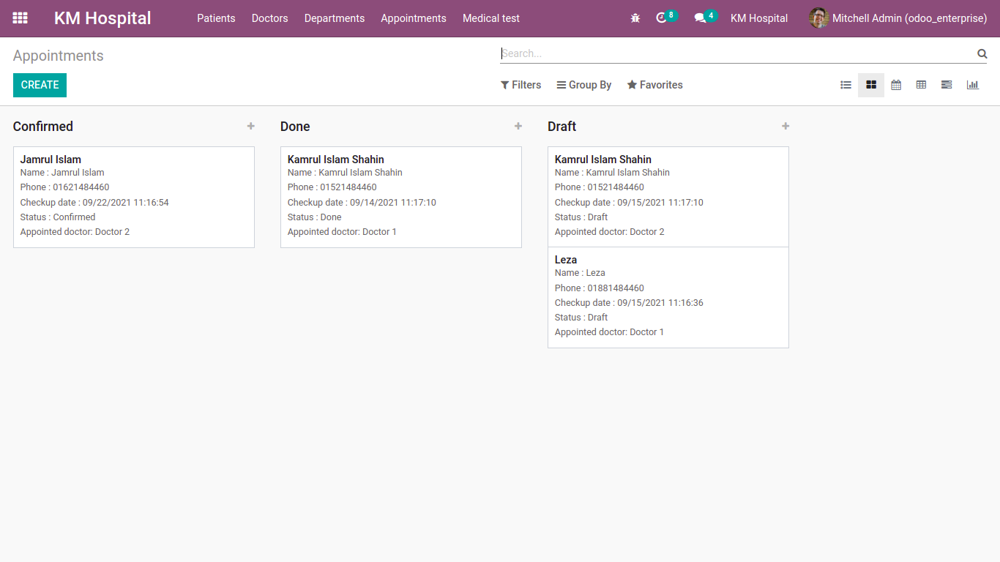 |
| Calendar View | 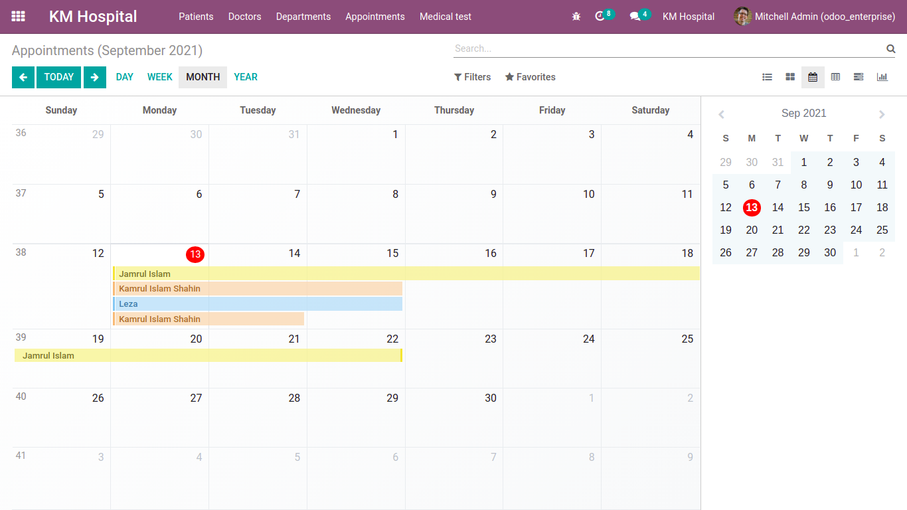 |
| Pivot View | 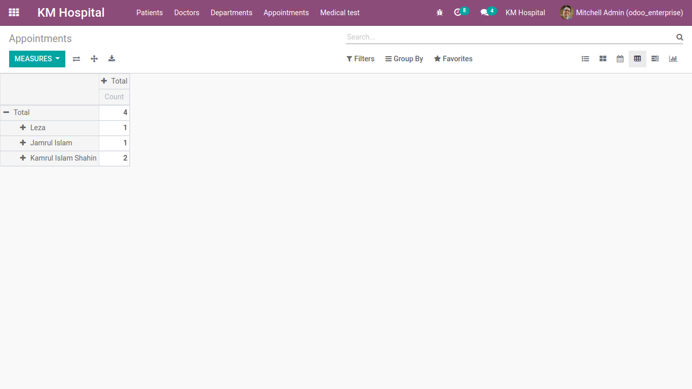 |
| Gantt View |  |
| Graph View | 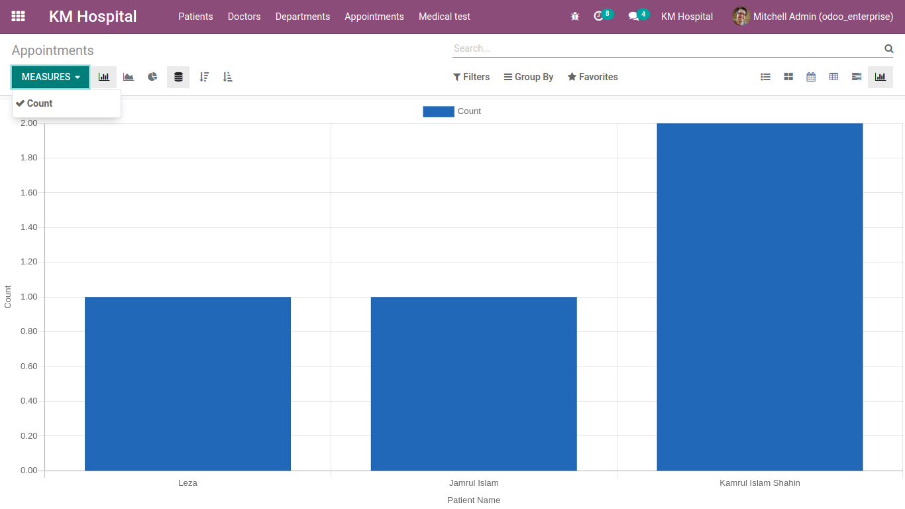 |

---

## 🧬 4. Medical Test Module

(Coming Soon 🔜) — Manage medical tests, reports, and lab results efficiently.

---

## ⚙️ Technologies Used

- **Odoo Framework**
- **Python**
- **XML**
- **PostgreSQL**
- **JavaScript (for dynamic views)**

---

## 💡 Future Improvements

- 🧾 Integration of billing & invoice module  
- 📈 Analytics dashboard for hospital data insights  
- 💬 Real-time communication between patients & doctors  
- 📱 Mobile-friendly responsive views  

---

## 👨‍💻 Author

**Dulal Hossain (Dulal)**  
📍 Green University of Bangladesh  
📧 [dulal@example.com](mailto:dulal@example.com)  
🌐 [Dulal-CSEcode YouTube Channel](https://www.youtube.com/@Dulal-CSEcode)

---

⭐ *If you like this project, don’t forget to star the repository and share it!*  
